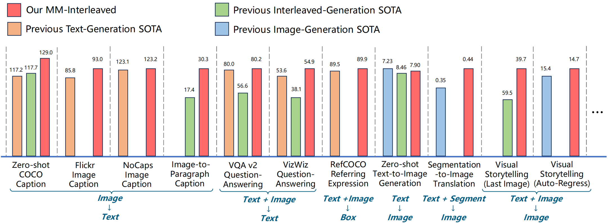
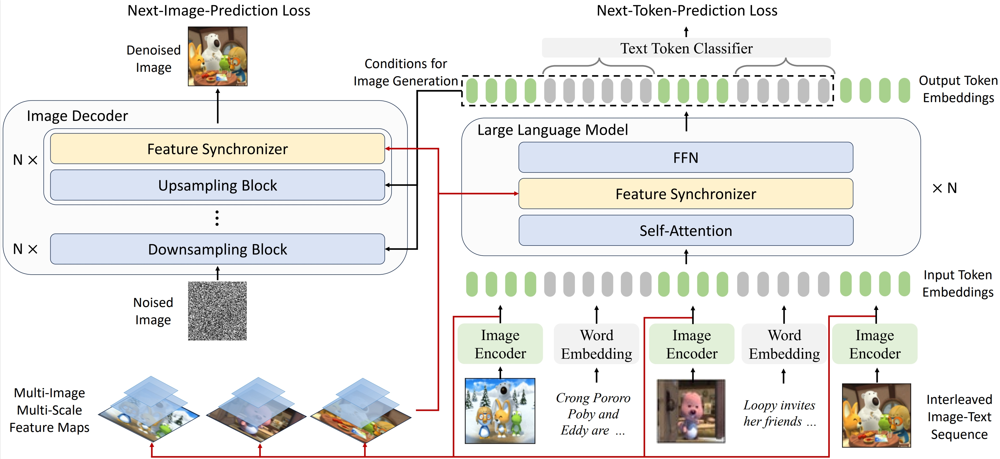
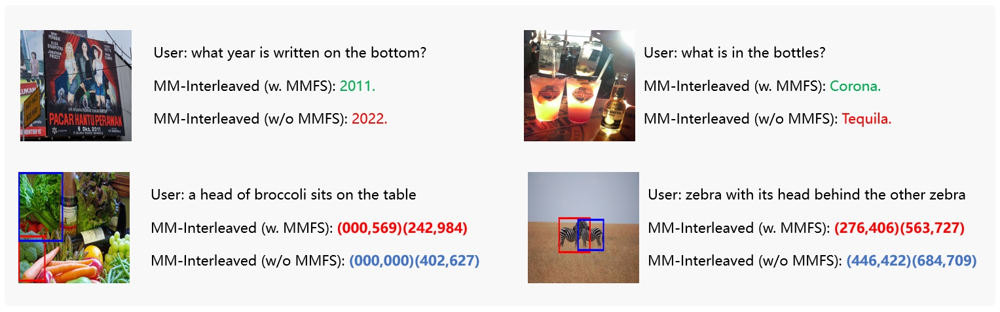
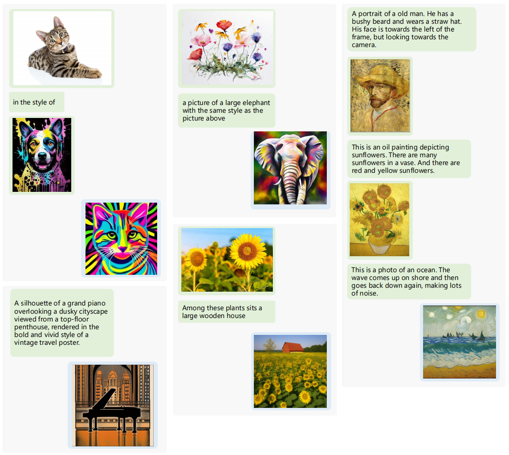
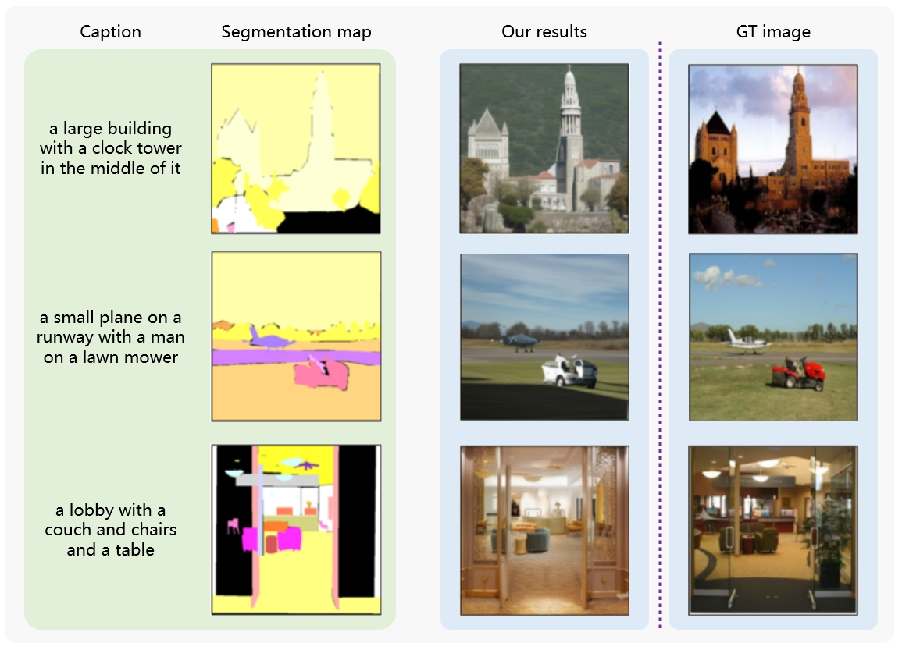
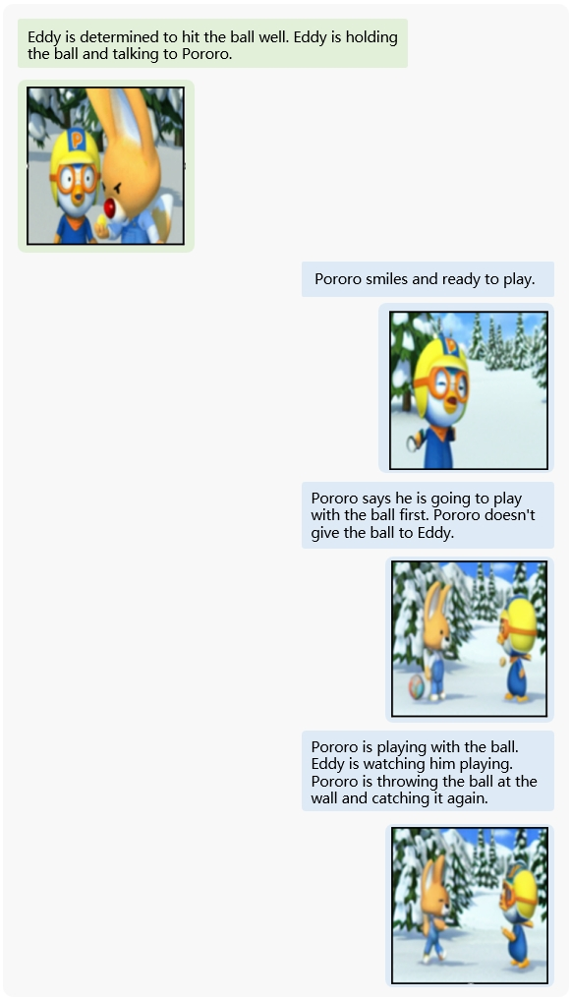

# MM-Interleaved: Interleaved Image-Text Generative Modeling via Multi-modal Feature Synchronizer

This is the official repository of **MM-Interleaved**: an end-to-end generative model for interleaved image-text data.



## Introduction

**MM-Interleaved** is a new end-to-end generative model for interleaved image-text modeling. It introduces a novel fine-grained multi-modal feature synchronizer named **MMFS**, allowing it to recognize multi-scale high-resolution features across multiple images for producing accurate textual descriptions and visually consistent images auto-regressively. Please refer to our [paper](https://arxiv.org/pdf/2401.10208.pdf) for more technical details.



The model is pretrained on a mixture of publicly available datasets, achieving superior zero-shot performance on various evaluation benchmarks of multi-modal comprehension and generation. It can be further fine-tuned for different downstream tasks, such as visual question answering, image captioning, referring expression grounding, text-to-image generation, segmentation-to-image translation, and visual storytelling. 

## Examples

<div align=center></div>

<div align=center></div>

<div align=center></div>

<div align=center></div>

## Setup

Step 1, clone the repository and use `pip` to install all required packages.

```shell
git clone https://github.com/OpenGVLab/MM-Interleaved
cd MM-Interleaved
pip install -r requirements.txt
# install `MultiScaleDeformableAttention` module
cd mm_interleaved/models/utils/ops
python setup.py install
```

Step 2, download all pretrained model components from huggingface into the `assets/` directory by running the following commands:

```
python mm_interleaved/scripts/download_hf_models.py
```

The pretrained model weights of MM-Interleaved (without instruction tuning or SFT) are provided at this [link](https://huggingface.co/OpenGVLab/MM-Interleaved/tree/main/mm_interleaved_pretrain), under Llama's [model license](https://github.com/facebookresearch/llama/blob/main/LICENSE). You can download them to `OUTPUT/mm_interleaved_pretrain` and use it for further inference, zero-shot evaluation or finetuning tasks.


## Inference

For inference, we provide an example inference script `./inference.py` and the corresponding configuration file `./mm_interleaved/configs/release/mm_inference.yaml`, which natively support interleaved image and text generation. Simply run the following command:

```
python -u inference.py --config_file=mm_interleaved/configs/release/mm_inference.yaml
```

The generation results will be automatically saved under the `./OUTPUT/mm_inference ` directory.

The interleaved inputs data is from `./docs/examples/annt.json`  by default. Feel free to modify it for custom generation. Below is an example of the interleaved input context:

```
{
    // list of input text sentences
    "sentences": [
        "a kitchen is shown with a variety of items on the counters."
    ], 
    // list of input image paths
    "images": [
        "./assets/dataset/coco/val2014/COCO_val2014_000000384213.jpg"
    ], 
    // list of corresponding sentence indexs for "images"
    "sentence_ixs": [
        0 
    ], 
    // list of the relative order of images and their corresponding sentences 
    "image_first": [
        false 
    ], 
    // the initial generation mode for the first iteration, which can be either "generate_images" or "generate_texts"
    "generate_mode": "generate_images",
    // the number of total iteration
    "num_iter": 1
}
```

Note that if the `"generate_mode"` is set to `"generate_images"`, then a padding image should be appended after the last sentence serving as a placeholder. Currently the inputs should contain at least 1 image (including the padding one if exists).


## Evaluation

We provide the script `./evaluate.py` and the corresponding configuration file `./mm_interleaved/configs/release/mm_eval.yaml` for zero-shot evaluation of our pretrained model on all benchmarks mentioned in our paper. We also upload all the annotation files [here](https://huggingface.co/OpenGVLab/MM-Interleaved/tree/main/assets/datasets) for easy access.

The evaluation is conducted by default under the slurm distributed environment. Please first download the pretrained model weights and the evaluation data per dataset under the same path specified in the configuration file. Then run the following commands:

``` 
bash slurm_run.sh ${GPUS} ${GPUS_PER_NODE} ${JOB_NAME} ${QUOTATYPE} ${PARATITION} evaluate.py ./mm_interleaved/configs/release/mm_eval.yaml
```

The file structure for all evaluation datasets is expected to be something like this:

```
├── coco
│   ├── annotations
│   │   ├── captions_val2014.json
│   │   ├── captions_val2017.json
│   │   ├── coco_karpathy_test_gt.json
│   │   ├── coco_karpathy_test.json
│   │   ├── coco_karpathy_val_gt.json
│   │   └── coco_karpathy_val.json
│   ├── test2014
│   ├── val2014
│   └── val2017
├── flickr30k
│   ├── flickr30k-images
│   └── test1k.token.coco_format
├── image2paragraph
│   ├── annotations
│   │   ├── paragraphs_coco.json
│   │   ├── paragraphs_v1.json
│   │   ├── test_split.json
│   │   └── val_split.json
│   └── images
├── lncoco
│   ├── coco_val_captions.jsonl
├── nocaps
│   ├── images
│   └── nocaps_val_4500_captions.json
├── OK-VQA
│   ├── mscoco_val2014_annotations.json
│   └── OpenEnded_mscoco_val2014_questions.json
├── textvqa
│   ├── textvqa_val_annotations.json
│   ├── textvqa_val_questions.json
│   └── train_images
├── visdial
│   ├── visdial_1.0_val_dense_annotations.json
│   ├── visdial_1.0_val.json
│   └── VisualDialog_val2018
├── VizWiz
│   ├── val
│   └── val.json
└── VQAv2
    ├── v2_mscoco_val2014_annotations.json
    └── v2_OpenEnded_mscoco_val2014_questions.json
```


## Pre-training

We also provide the pre-training script `./train.py`  and the corresponding configuration file `mm_interleaved/configs/release/mm_pretrain.yaml`. By default, we use DeepSpeed ZeRO-1 for efficient distributed training under slurm environment. The training engine is implemented based on the huggingface's trainer.

We use webdataset for efficient data loading. For MMC4 dataset, simply download all the images and annotation files under the same directory specified in the configuration file. The raw annotation file with the suffix `.jsonl.zip` can be directly processed on the fly without further modification.  For image-text pair datasets such as LAION-COCO and LAION-En, each annotation file is expected to have ~10,000 lines of image-text pair data. Each line is a json dictionary containing two key-value pairs, i.e. the "image" and corresponding "caption". An example annotation file is provided at `./docs/examples/0000001.txt`. After preparing all the pretrained data, please modify the data paths as well as other relative arguments in the configuration file.

Moreover, we support zero-shot evaluation for multiple datasets during training as well. To achieve this, modify the `data.val` part of the training configuration file and include the configs of the evaluation datasets which you want to monitor in real time during training.

The pre-training command is:

```
bash slurm_run.sh ${GPUS} ${GPUS_PER_NODE} ${JOB_NAME} ${QUOTATYPE} ${PARATITION} train.py ./mm_interleaved/configs/release/mm_pretrain.yaml
```


## Schedule

- [x] Release inference & evaluation code

- [x] Release pre-training code

- [x] Release pre-training model weights

- [ ] Release finetuning code


## Acknowledgements

We thank the great work from [OpenFlamingo](https://github.com/mlfoundations/open_flamingo), [transformers](https://github.com/huggingface/transformers), [diffusers](https://github.com/huggingface/diffusers), [LLaMA](https://github.com/facebookresearch/llama), [CLIP](https://github.com/openai/CLIP), [BLIP](https://github.com/salesforce/BLIP), and [ViT-Adapter](https://github.com/czczup/ViT-Adapter).


## Citing

If you find MM-Interleaved helpful, please consider giving this repository a star :star: and citing in your publications.

```BibTeX
@article{tian2024mminterleaved,
  title={MM-Interleaved: Interleaved Image-Text Generative Modeling via Multi-modal Feature Synchronizer}, 
  author={Tian, Changyao and Zhu, Xizhou and Xiong, Yuwen and Wang, Weiyun and Chen, Zhe and Wang, Wenhai and Chen, Yuntao and Lu, Lewei and Lu, Tong and Zhou, Jie and Li, Hongsheng and Qiao, Yu and Dai, Jifeng},
  journal={arXiv preprint arXiv:2401.10208},
  year={2024},
}
```


## License

This project is released under the [Apache 2.0 license](https://github.com/OpenGVLab/MM-Interleaved/blob/main/LICENSE). Parts of this project contain code and models from other sources, which are subject to their respective licenses.
